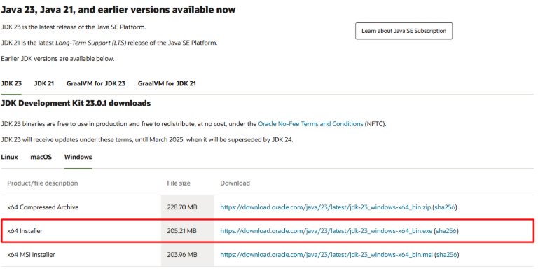
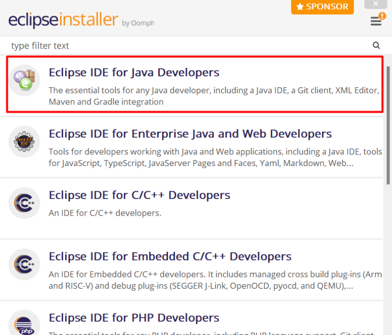
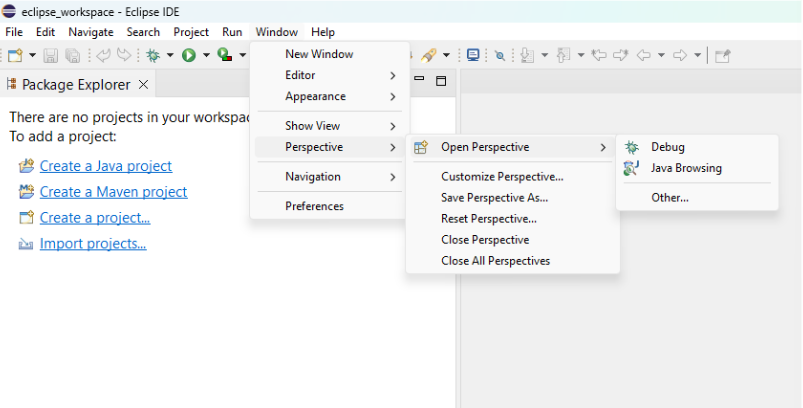
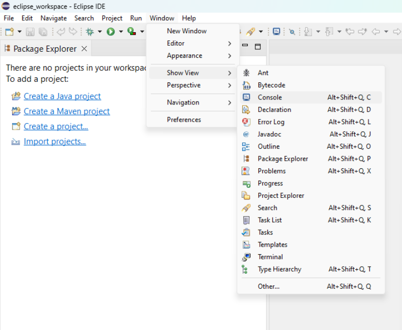

# Instalação

# Sumário

1. [Instalação](#instalação)
   - [Instalando o JDK da Oracle](#instalando-o-jdk-da-oracle)
     - [Passo 1: Baixar o JDK](#passo-1-baixar-o-jdk)
     - [Passo 2: Executar o Instalador do JDK](#passo-2-executar-o-instalador-do-jdk)
     - [Passo 3: Configurar a Variável de Ambiente JAVA_HOME](#passo-3-configurar-a-variável-de-ambiente-java_home)
     - [Passo 4: Adicionar o JDK ao PATH](#passo-4-adicionar-o-jdk-ao-path)
     - [Passo 5: Verificar a Instalação do JDK](#passo-5-verificar-a-instalação-do-jdk)
   - [Instalando o Eclipse IDE](#instalando-o-eclipse-ide)
     - [Passo 1: Baixar o Eclipse IDE](#passo-1-baixar-o-eclipse-ide)
     - [Passo 2: Executar o Instalador do Eclipse](#passo-2-executar-o-instalador-do-eclipse)
     - [Passo 3: Iniciar o Eclipse IDE](#passo-3-iniciar-o-eclipse-ide)

2. [Preparando o Ambiente](#preparando-o-ambiente)
   - [Mudar o Layout](#mudar-o-layout)
   - [Zerar o Layout](#zerar-o-layout)
   - [Mostrar a Aba Console](#mostrar-a-aba-console)
   - [Criar Projeto](#criar-projeto)

3. [Verificando o Funcionamento do Ambiente](#verificando-o-funcionamento-do-ambiente)
   - [Passo 1: Criar um Novo Projeto Java no Eclipse](#passo-1-criar-um-novo-projeto-java-no-eclipse)
   - [Passo 2: Criar uma Classe Java](#passo-2-criar-uma-classe-java)
   - [Passo 3: Escrever e Executar o Código](#passo-3-escrever-e-executar-o-código)

4. [Criando um Novo Projeto Java Diretamente pelo Eclipse](#criando-um-novo-projeto-java-diretamente-pelo-eclipse)
   - [Abrir o Eclipse](#abrir-o-eclipse)
   - [Iniciar um Novo Projeto](#iniciar-um-novo-projeto)
   - [Definir o Nome e Localização do Projeto](#definir-o-nome-e-localização-do-projeto)
   - [Escolher a Versão do JRE ou JDK](#escolher-a-versão-do-jre-ou-jdk)
   - [Ajustar Layout do Projeto (Opcional)](#ajustar-layout-do-projeto-opcional)
   - [Finalizar a Criação](#finalizar-a-criação)
   - [Verificar Estrutura no Package Explorer](#verificar-estrutura-no-package-explorer)
   - [Criar uma Classe Principal (Opcional)](#criar-uma-classe-principal-opcional)
   - [Executar o Projeto](#executar-o-projeto)

5. [Conclusão](#conclusão)


Para iniciar o desenvolvimento em Java, é necessário instalar o Java Development Kit (JDK), que fornece as ferramentas essenciais para compilar e executar programas Java. Em seguida, vamos instalar o Eclipse IDE, um ambiente integrado que facilita a escrita e o gerenciamento do código Java. Abaixo, apresento um guia passo a passo detalhado para a instalação no sistema operacional Windows.

## Instalando o JDK da Oracle

### Passo 1: Baixar o JDK
1. Abra seu navegador e acesse a página de download oficial da Oracle: [Oracle Java Downloads](https://www.oracle.com/java/technologies/javase-downloads.html).
2. Clique na versão mais recente do Java SE Development Kit (JDK) disponível. A versão recomendada será indicada na página.
3. Na seção de downloads, selecione o arquivo de instalação para Windows, geralmente nomeado como `jdk-[versão]_windows-x64_bin.exe`.



### Passo 2: Executar o Instalador do JDK
1. Localize o arquivo baixado (`jdk-[versão]_windows-x64_bin.exe`) na pasta de downloads.
2. Clique duas vezes no arquivo para iniciar o instalador.
3. Na tela inicial do instalador, clique em **Next** para prosseguir.
4. Escolha o diretório de instalação ou mantenha o local padrão (`C:\Program Files\Java\jdk-[versão]`) e clique em **Next**.
5. Aguarde a conclusão do processo de instalação e, ao final, clique em **Close**.

### Passo 3: Configurar a Variável de Ambiente JAVA_HOME
1. Abra o Painel de Controle e vá até **Sistema e Segurança > Sistema**.
2. No painel da esquerda, clique em **Configurações avançadas do sistema**.
3. Na janela que abrir, clique no botão **Variáveis de Ambiente**.
4. Em **Variáveis do Sistema**, clique em **Nova...**.
   - No campo **Nome da variável**, digite `JAVA_HOME`.
   - No campo **Valor da variável**, insira o caminho onde o JDK foi instalado (por exemplo, `C:\Program Files\Java\jdk-[versão]`).
5. Clique em **OK** para confirmar.

### Passo 4: Adicionar o JDK ao PATH
1. Ainda na janela de **Variáveis de Ambiente**, localize a variável `Path` na lista **Variáveis do Sistema** e clique em **Editar**.
2. Na janela de edição, clique em **Novo** e adicione o caminho `C:\Program Files\Java\jdk-[versão]\bin`.
3. Clique em **OK** para fechar todas as janelas e aplicar as configurações.

### Passo 5: Verificar a Instalação do JDK
1. Abra o Prompt de Comando (aperte a tecla **Windows**, digite `cmd` e pressione **Enter**).
2. No Prompt de Comando, digite `java -version` e pressione **Enter**.
   - Você deverá ver a versão do Java instalada.
3. Em seguida, digite `javac -version` e pressione **Enter** para verificar o compilador Java.
   - Se ambos os comandos exibirem a versão correta do JDK, o JDK está instalado e configurado com sucesso.

## Instalando o Eclipse IDE

### Passo 1: Baixar o Eclipse IDE
1. Acesse o site oficial do Eclipse: [Eclipse Downloads](https://www.eclipse.org/downloads/).
2. Na página inicial, clique em **Download** para obter a versão mais recente do *Eclipse IDE for Java Developers*.
3. Ao ser redirecionado para a página de download, clique no link **Download** para baixar o instalador do Eclipse.

### Passo 2: Executar o Instalador do Eclipse
1. Localize o arquivo baixado (`eclipse-inst-jre-win64.exe`) e clique duas vezes para abrir o instalador.
2. No instalador, selecione *Eclipse IDE for Java Developers*.
3. Escolha o diretório onde o Eclipse será instalado ou mantenha o padrão (geralmente em `C:\Users\[Seu Usuário]\eclipse`).
4. Clique em **INSTALL** para iniciar a instalação. Aceite os termos de licença se solicitado.



### Passo 3: Iniciar o Eclipse IDE
1. Após a instalação, clique em **Launch** para abrir o Eclipse.
2. Ao abrir pela primeira vez, o Eclipse solicitará a seleção de um workspace. O workspace é a pasta onde todos os projetos e configurações do Eclipse serão armazenados.
3. Escolha um local para o workspace ou mantenha o padrão.
4. Clique em **Launch** para iniciar o ambiente de desenvolvimento.

## Preparando o Ambiente

### Mudar o Layout
1. Vá em **Window > Perspective > Open Perspective > Java**.



### Zerar o Layout
1. Acesse **Window > Perspective > Reset Perspective**.


### Mostrar a Aba Console
1. Navegue até **Window > Show View > Console**.



### Criar Projeto
1. Vá em **File > New > Java Project**.


## Verificando o Funcionamento do Ambiente

### Passo 1: Criar um Novo Projeto Java no Eclipse
1. No Eclipse, vá para **File > New > Java Project**.
2. Digite o nome do projeto (por exemplo, `HelloWorld`) e clique em **Finish**.


### Passo 2: Criar uma Classe Java
1. Clique com o botão direito no projeto recém-criado (no painel *Project Explorer*), selecione **New > Class**.


2. No campo **Name**, insira `HelloWorld` e marque a opção para adicionar o método `public static void main(String[] args)`.


3. Clique em **Finish**.


### Passo 3: Escrever e Executar o Código
Digite o seguinte código no editor de código:
```java
public class HelloWorld {
    public static void main(String[] args) {
        System.out.println("Olá, mundo!");
    }
}
```

---

# Criando um Novo Projeto Java Diretamente pelo Eclipse

1. **Abrir o Eclipse**  
   - Inicie o Eclipse a partir do atalho ou menu de aplicativos.  
   - Se for solicitado, escolha o **workspace** onde deseja armazenar seus projetos (por exemplo, a pasta `JAVA`).

2. **Iniciar um Novo Projeto**  
   - No menu superior, clique em **File** > **New** > **Java Project**.  
   - Será exibida a janela **New Java Project**.

3. **Definir o Nome e Localização do Projeto**  
   - Em **Project Name**, digite o nome do seu projeto (ex.: `MeuProjeto`).  
   - Se quiser criar o projeto no **workspace** atual, mantenha **Use default location** marcado.  
   - Para usar uma pasta específica fora do workspace, desmarque **Use default location** e selecione manualmente o caminho.

4. **Escolher a Versão do JRE ou JDK**  
   - Verifique a seção **Project > JRE**.  
   - Selecione a versão do Java (ex.: `JavaSE-17`) que deseja utilizar.  
   - Se necessário, configure um **Execution environment** ou adicione um **Alternate JRE**.

5. **Ajustar Layout do Projeto (Opcional)**  
   - A seção **Project Layout** apresenta duas opções:  
     - **Use project folder as root** (padrão): todos os arquivos e pastas ficarão centralizados.  
     - **Create separate folders for sources and class files**: separa arquivos `.class` em uma pasta `bin`.  
   - Escolha de acordo com sua preferência.

6. **Finalizar a Criação**  
   - Clique em **Finish**.  
   - Se aparecer a mensagem **Open Associated Perspective**, confirme com **Yes** para abrir a perspectiva Java.

7. **Verificar Estrutura no Package Explorer**  
   - Localize seu novo projeto no painel **Package Explorer**.  
   - Expanda o projeto para ver a pasta `src`, onde seus arquivos Java serão criados.

8. **Criar uma Classe Principal (Opcional)**  
   - Clique com o botão direito em **src** > **New** > **Class**.  
   - Em **Name**, defina o nome (ex.: `Main`).  
   - Marque **public static void main(String[] args)** se desejar criar o método principal automaticamente.  
   - Clique em **Finish**.

9. **Executar o Projeto**  
   - Escreva o código desejado na classe criada.  
   - Clique com o botão direito na classe > **Run As** > **Java Application**.  
   - A saída do programa aparecerá na aba **Console**, confirmando o funcionamento do projeto.

**Conclusão**  
Seguindo esses passos, o Eclipse criará automaticamente os arquivos de configuração necessários (`.project` e `.classpath`) e a pasta `src`, permitindo que você trabalhe imediatamente em seu novo projeto Java sem etapas extras de importação ou configuração.