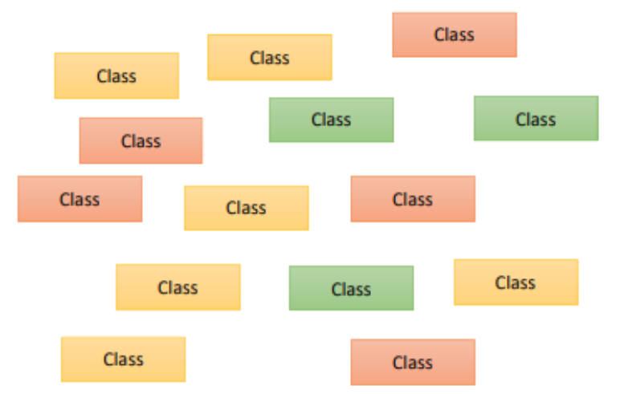
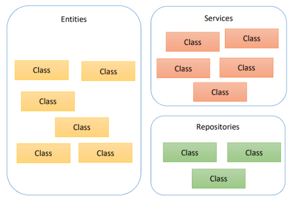
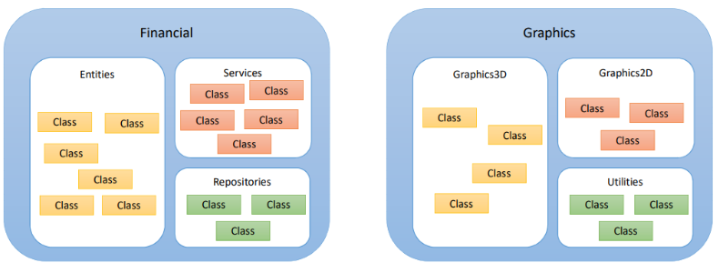

# **Sumário Interativo**

- [Introdução ao Java](#introdução-ao-java)
  - [Java: Uma Linguagem Multiplataforma](#java-uma-linguagem-multiplataforma)
- [Introdução à Programação com Java](#introdução-à-programação-com-java)
  - [1. Algoritmo](#1-algoritmo)
  - [2. Programa](#2-programa)
  - [3. Regras de Linguagem](#3-regras-de-linguagem)
    - [3.1 Regras Léxicas](#31-regras-léxicas)
    - [3.2 Regras de Sintaxe](#32-regras-de-sintaxe)
  - [4. IDE (Integrated Development Environment)](#4-ide-integrated-development-environment)
  - [5. Execução de Código](#5-execução-de-código)
    - [5.1 Compilação](#51-compilação)
    - [5.2 Interpretação](#52-interpretação)
    - [5.3 Máquina Virtual](#53-máquina-virtual)
  - [6. Versões do Java](#6-versões-do-java)
  - [7. O Que Baixar: JVM, JRE ou JDK?](#7-o-que-baixar-jvm-jre-ou-jdk)
    - [7.1 JVM (Java Virtual Machine)](#71-jvm-java-virtual-machine)
    - [7.2 JRE (Java Runtime Environment)](#72-jre-java-runtime-environment)
    - [7.3 JDK (Java Development Kit)](#73-jdk-java-development-kit)
- [Estrutura de uma Aplicação Java](#estrutura-de-uma-aplicação-java)
  - [1. Packages: Agrupamento Lógico de Classes](#1-packages-agrupamento-lógico-de-classes)
  - [2. Módulos (Introduzido no Java 9+): Agrupamento Lógico de Pacotes](#2-módulos-introduzido-no-java-9-agrupamento-lógico-de-pacotes)
  - [3. Runtime: Agrupamento Físico de Módulos](#3-runtime-agrupamento-físico-de-módulos)

---

# Introdução ao Java

Na década de 1990, o desenvolvimento de software enfrentava desafios significativos, como:

- Gerenciamento complexo de memória.
- Falta de bibliotecas.
- Problemas de portabilidade entre sistemas operacionais.
- Alto custo de implementação.

Para resolver esses problemas, a **Sun Microsystems** formou o **"Green Team"**, liderado por **James Gosling**: 

  
  

O objetivo da equipe era criar uma solução inovadora voltada inicialmente para pequenos dispositivos, como TVs e videocassetes.
O foco inicial era desenvolver uma linguagem que permitisse escrever um único código que funcionasse em diferentes dispositivos, facilitando a reusabilidade de software em eletrônicos variados.

A equipe desenvolveu a **Máquina Virtual Java (JVM)**, que possibilita que o código Java seja interpretado e executado independentemente do hardware.
Apesar de a ideia original não ter gerado contratos imediatos com fabricantes de eletrônicos, ela ganhou relevância com o advento da internet. Em **1994**, o Java foi reposicionado para rodar pequenas aplicações dentro de navegadores, conhecidas como **applets**, que poderiam ser executados diretamente no navegador, independente do sistema operacional.

---

 

# Java: Uma Linguagem Multiplataforma

Um dos grandes diferenciais do Java é seu conceito de **"escreva uma vez, rode em qualquer lugar"** (*write once, run anywhere*). Isso significa que um programa escrito em Java pode ser executado em qualquer sistema operacional que tenha uma **JVM** instalada.

### Como Funciona?

A JVM atua como uma camada intermediária entre o código Java e o sistema operacional, tornando o Java uma linguagem multiplataforma desde sua criação. Esse recurso foi especialmente valioso no início dos anos 2000, quando diferentes sistemas operacionais eram amplamente utilizados.

---

 

# Introdução à Programação com Java

---

## 1. Algoritmo

### Definição
Um algoritmo é uma sequência bem definida de passos que resolve um problema específico ou executa uma tarefa. Ele fornece instruções passo a passo para atingir um objetivo, seja resolver uma operação matemática, realizar um cálculo ou processar dados.

### Exemplo
Um algoritmo para somar dois números:
1. Receber o primeiro número.
2. Receber o segundo número.
3. Somar os dois valores.
4. Exibir o resultado.

---

## 2. Programa

### Definição
Um programa é um conjunto de algoritmos codificados em uma linguagem que o computador entende e pode executar. Ele transforma um ou mais algoritmos em uma sequência de instruções que o computador segue para realizar tarefas automaticamente.

### Exemplo
Um programa de calculadora que permite ao usuário realizar operações matemáticas (soma, subtração, multiplicação e divisão) é composto por diferentes algoritmos, um para cada operação.

---

 

## 3. Regras de Linguagem

### 3.1 Regras Léxicas
Definem o conjunto de símbolos válidos em uma linguagem, como palavras-chave, operadores, identificadores e números. Dizem respeito à **correção das palavras isoladas**.

#### Exemplo:
- **Português:** cachorro (correto), caxorro (errado).  
- **Java:** `main` (correto), `maim` (errado).

### 3.2 Regras de Sintaxe
Definem como organizar as palavras e símbolos para formar sentenças válidas na linguagem, isto é, sua **gramática**.

#### Exemplo:
- **Português:** O cachorro está com fome (correto), A cachorro está com fome (errado).  
- **Java:** `x = 2 + y` (correto), `x = + 2 y` (errado).

---

 

## 4. IDE (Integrated Development Environment)

### Definição
Uma **IDE** é um ambiente integrado de desenvolvimento que oferece ferramentas para facilitar a criação e manutenção de software.

### Funcionalidades Principais
1. **Edição de Código:** Autocompletar, indentação e destaque de palavras-chave.
2. **Depuração:** Identificação e correção de erros.
3. **Build (Construção):** Compilação e organização do código para gerar o produto final.
4. **Templates:** Modelos prontos para acelerar o desenvolvimento.

---

 

## 5. Execução de Código

### Definição
Transformar o código-fonte em instruções executáveis. Existem diferentes abordagens para isso:

### 5.1 Compilação
Tradução do código-fonte para código de máquina antes da execução, gerando um **código objeto** e um **executável**.

#### Características
- **Vantagens:**  
  1. Velocidade na execução.  
  2. Detecção de erros antes da execução.  

### 5.2 Interpretação
O código é analisado e executado linha por linha por um **interpretador**.

#### Características
- **Vantagens:**  
  1. Flexibilidade para atualizações.  
  2. Portabilidade entre diferentes plataformas.  

### 5.3 Máquina Virtual
Uma abordagem híbrida que combina compilação e interpretação.  
1. O código-fonte é compilado em **bytecode**.
2. A **Máquina Virtual (VM)** interpreta e executa o bytecode.

#### Exemplo
- Java: **Java Virtual Machine (JVM)**.  
- C#: **Microsoft .NET Framework**.

### Definições de Conceitos
- **Código Fonte:** Texto original escrito pelo programador.  
- **Código Objeto:** Código binário gerado após a compilação, pronto para execução.

---

 

## 6. Versões do Java

### Principais Versões
1. **Java 1.0 e 1.1:** Introduziram bibliotecas fundamentais como JDBC (Java Database Connectivity) e `java.io`.
2. **Java 1.2 (Java2):** A API cresceu significativamente, adicionando novos pacotes.
3. **Java 1.5 (Java 5):** Mudanças significativas na linguagem e simplificação da nomenclatura.
4. **Java 6, 7 e 8:** Adoção da convenção numérica simplificada e introdução de recursos como expressões lambda e API de Streams (Java 8).

---

 

## 7. O Que Baixar: JVM, JRE ou JDK?

### 7.1 JVM (Java Virtual Machine)
Componente responsável por executar o bytecode Java em qualquer máquina.  
**Nota:** A JVM vem integrada ao JRE ou ao JDK.

### 7.2 JRE (Java Runtime Environment)
- Inclui a JVM e as bibliotecas necessárias para executar aplicativos Java.
- Ideal para quem precisa **apenas executar** aplicações Java.

### 7.3 JDK (Java Development Kit)
- Inclui o JRE, a JVM e ferramentas adicionais como o compilador `javac`.
- Essencial para **desenvolvedores Java**.

----

 
 

# Estrutura de uma Aplicação Java

Na construção de uma aplicação Java, é fundamental entender como a organização dos arquivos impacta a legibilidade, modularidade e escalabilidade do sistema. Desde o início, Java foi projetado como uma linguagem **Orientada a Objetos (POO)**, onde as aplicações são compostas por classes organizadas de forma lógica e física.

Abaixo estão os principais elementos que compõem a estrutura de uma aplicação Java moderna.

---

## 1. **Packages: Agrupamento Lógico de Classes**

### Definição
Os **packages** (ou pacotes) são usados para organizar classes de maneira lógica e hierárquica. Eles permitem:
- Agrupar classes relacionadas em "pastas" virtuais.
- Tornar o código mais modular e fácil de entender.
- Evitar conflitos de nomes entre classes, especialmente em projetos grandes.

### Vantagens
- **Modularidade:** Agrupa classes relacionadas.
- **Legibilidade:** Facilita a navegação pelo projeto.
- **Evita Conflitos:** Classes com o mesmo nome podem coexistir em pacotes diferentes.

### Exemplos de Packages Comuns

| **Package**     | **Descrição**                                              |
|------------------|-----------------------------------------------------------|
| `entities`       | Contém classes que representam entidades do sistema, como `Produto`, `Cliente`, `Pedido`. |
| `services`       | Armazena classes que implementam a lógica de negócios, como `PedidoService` ou `ClienteService`. |
| `repositories`   | Contém classes que lidam com a persistência de dados, como `ProdutoRepository` ou `ClienteRepository`. |

 

## 2. **Módulos (Introduzido no Java 9+): Agrupamento Lógico de Pacotes**

### Definição
Com o **Java 9**, foi introduzido o conceito de **módulos**, que permitem agrupar pacotes relacionados em um conjunto lógico maior. Eles fornecem:
- Maior controle sobre a organização e o compartilhamento de código.
- Segurança e eficiência ao expor apenas pacotes e classes necessários para outros módulos.

### Vantagens
- **Modularidade Maior:** Organiza pacotes em agrupamentos lógicos maiores.
- **Controle de Acesso:** Expõe apenas o que é necessário.
- **Escalabilidade:** Facilita o desenvolvimento de aplicações maiores.

### Exemplo de Módulos

| **Módulo**        | **Pacotes Incluídos**                                                      |
|--------------------|---------------------------------------------------------------------------|
| `Módulo Financeiro` | Contém pacotes como `entities`, `services` e `repositories` voltados para a lógica financeira. |
| `Módulo Gráficos`   | Inclui pacotes como `graphics`, `graphics3d` e `utilities`, relacionados ao processamento gráfico. |

 

## 3. **Runtime: Agrupamento Físico de Módulos**

### Definição
O **runtime** refere-se ao agrupamento físico dos módulos necessários para a execução de uma aplicação. Ele representa os módulos e pacotes que serão compilados e estarão disponíveis em tempo de execução.

### Características
- **Nível Lógico:** Módulos como `Financeiro` e `Gráficos` são agrupados e organizados em código.
- **Nível Físico:** Após a compilação, esses módulos geram o **build/runtime**, que consiste em arquivos executáveis que representam a unidade física da aplicação.

### Exemplo
Se uma aplicação contém os módulos `Financeiro` e `Gráficos`:
- **Lógico:** Organização dos pacotes e classes em módulos.
- **Físico:** Os módulos são compilados em arquivos executáveis (por exemplo, `.jar`) e instalados no dispositivo para execução.

---
