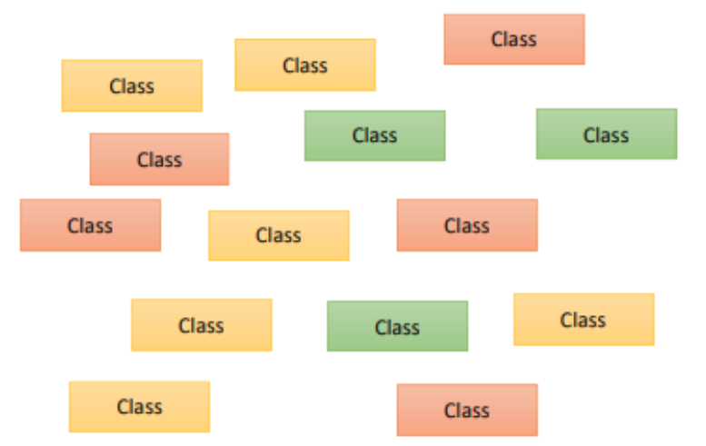
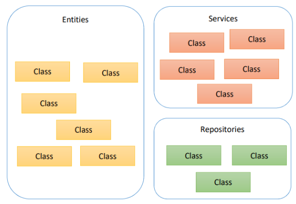
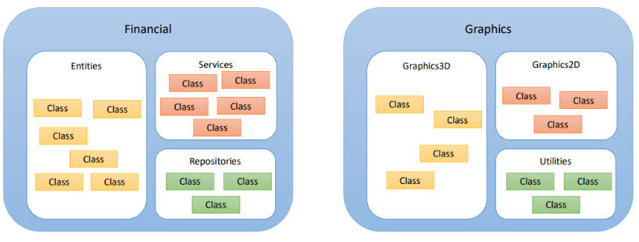

# Programação com Java

## Sumário
0. [Estrutura de uma Aplicação Java](#estrutura-de-uma-aplicação-java)
    - [1. Packages: Agrupamento Lógico de Classes](#1-packages-agrupamento-lógico-de-classes)
    - [2. Módulos (Introduzido no Java 9+): Agrupamento Lógico de Pacotes](#2-módulos-introduzido-no-java-9-agrupamento-lógico-de-pacotes)
    - [3. Runtime: Agrupamento Físico de Módulos](#3-runtime-agrupamento-físico-de-módulos)
1. [Java Syntax Básica](#java-syntax-básica)
    1. [Terminologia Básica e Convenções de Nomenclatura](#1-terminologia-básica-e-convenções-de-nomenclatura)
        - [Principais Termos](#11-principais-termos)
        - [Convenções de Nomenclatura](#12-convenções-de-nomenclatura)
    2. [Palavras Reservadas](#2-palavras-reservadas)
2. [Entrada e Saída de Dados](#3-entrada-e-saída-de-dados)
    1. [Saída de Dados](#31-saída-de-dados)
        - [Usando `System.out.print()`](#exemplo-usando-systemoutprint)
        - [Usando `System.out.println()`](#exemplo-usando-systemoutprintln)
    2. [Imprimindo o Conteúdo de Variáveis](#32-imprimindo-o-conteúdo-de-variáveis)
        - [Tipos Primitivos](#variáveis-de-tipos-primitivos)
        - [Ponto Flutuante](#variáveis-de-ponto-flutuante)
    3. [Formatação com `System.out.printf()`](#33-formatação-de-saída-com-systemoutprintf)
        - [Placeholders Comuns](#placeholders-comuns)
        - [Controlando o Separador de Decimais](#34-controlando-o-separador-de-decimais)
    4. [Concatenando Elementos na Saída](#4-concatenando-elementos-na-saída)
        - [Usando `+` com `print` e `println`](#41-usando-com-print-e-println)
        - [Usando `printf`](#42-usando-printf-com-placeholders)
3. [Comentários em Java](#5-comentários-em-java)
    - [Linha Única](#51-comentário-de-linha-única)
    - [Múltiplas Linhas](#52-comentário-de-múltiplas-linhas)
    - [JavaDoc](#53-comentário-de-documentação-javadoc)
4. [Tipos de Dados e Variáveis](#tipos-de-dados-e-variáveis-em-java)
    1. [Variáveis](#variáveis)
    2. [Tipos de Variáveis](#tipos-de-variáveis-em-java)
        - [Variáveis Locais](#11-variável-local)
        - [Variáveis de Instância](#12-variável-de-instância)
        - [Variáveis Estáticas](#13-variável-estática)
    3. [Convenções de Nomeação](#convenções-para-nomes-de-variáveis-em-java)
    4. [Tipos Primitivos](#tipos-primitivos)
    5. [Tipos Não Primitivos](#tipos-não-primitivos)
5. [Strings em Java](#strings-em-java)
    - [Principais Métodos da Classe String](#principais-métodos-da-classe-string)
6. [Enums (Enumerations)](#enums-enumerations)
7. [Casting](#casting-em-java)
    - [Exemplo sem Casting](#exemplo-sem-casting)
    - [Exemplo com Casting](#exemplo-com-casting)
8. [Expressões Lógicas](#expressões-lógicas)
    - [Operadores Lógicos](#operadores-lógicos)
9. [Operadores Bitwise](#operadores-bitwise)
    - [Principais Operadores](#principais-operadores-bitwise)
    - [Verificar um Bit Específico](#aplicação-comum-verificar-um-bit-específico)
10. [Estruturas Condicionais](#estruturas-condicionais)
    - [Simples e Compostas](#estruturas-simples-e-compostas)
    - [Condicional Ternária](#condicional-ternária)
11. [Estruturas de Repetição](#estruturas-de-repetição)
    - [Estrutura `while`](#1-estrutura-while)
    - [Estrutura `for`](#2-estrutura-for)
    - [Estrutura `do-while`](#3-estrutura-do-while)
12. [Teste de Mesa](#teste-de-mesa)
    - [Exemplo com `while`](#exemplo-com-while)
    - [Exemplo com `for`](#exemplo-com-for)

---


<br>

# Estrutura de uma Aplicação Java

Na construção de uma aplicação Java, é fundamental entender como a organização dos arquivos impacta a legibilidade, modularidade e escalabilidade do sistema. Desde o início, Java foi projetado como uma linguagem **Orientada a Objetos (POO)**, onde as aplicações são compostas por classes organizadas de forma lógica e física.



Abaixo estão os principais elementos que compõem a estrutura de uma aplicação Java moderna.

---

## 1. **Packages: Agrupamento Lógico de Classes**

Os **packages** (ou pacotes) são usados para organizar classes de maneira lógica e hierárquica. Eles permitem:
- Agrupar classes relacionadas em "pastas" virtuais.
- Tornar o código mais modular e fácil de entender.
- Evitar conflitos de nomes entre classes, especialmente em projetos grandes.



### Vantagens
- **Modularidade:** Agrupa classes relacionadas.
- **Legibilidade:** Facilita a navegação pelo projeto.
- **Evita Conflitos:** Classes com o mesmo nome podem coexistir em pacotes diferentes.

### Exemplos de Packages Comuns

| **Package**     | **Descrição**                                              |
|------------------|-----------------------------------------------------------|
| `entities`       | Contém classes que representam entidades do sistema, como `Produto`, `Cliente`, `Pedido`. |
| `services`       | Armazena classes que implementam a lógica de negócios, como `PedidoService` ou `ClienteService`. |
| `repositories`   | Contém classes que lidam com a persistência de dados, como `ProdutoRepository` ou `ClienteRepository`. |

<br>

## 2. **Módulos (Introduzido no Java 9+): Agrupamento Lógico de Pacotes**

Com o **Java 9**, foi introduzido o conceito de **módulos**, que permitem agrupar pacotes relacionados em um conjunto lógico maior. Eles fornecem:
- Maior controle sobre a organização e o compartilhamento de código.
- Segurança e eficiência ao expor apenas pacotes e classes necessários para outros módulos.



### Vantagens
- **Modularidade Maior:** Organiza pacotes em agrupamentos lógicos maiores.
- **Controle de Acesso:** Expõe apenas o que é necessário.
- **Escalabilidade:** Facilita o desenvolvimento de aplicações maiores.

### Exemplo de Módulos

| **Módulo**        | **Pacotes Incluídos**                                                      |
|--------------------|---------------------------------------------------------------------------|
| `Módulo Financeiro` | Contém pacotes como `entities`, `services` e `repositories` voltados para a lógica financeira. |
| `Módulo Gráficos`   | Inclui pacotes como `graphics`, `graphics3d` e `utilities`, relacionados ao processamento gráfico. |

<br>

## 3. **Runtime: Agrupamento Físico de Módulos**

O **runtime** refere-se ao agrupamento físico dos módulos necessários para a execução de uma aplicação. Ele representa os módulos e pacotes que serão compilados e estarão disponíveis em tempo de execução.

### Características
- **Nível Lógico:** Módulos como `Financeiro` e `Gráficos` são agrupados e organizados em código.
- **Nível Físico:** Após a compilação, esses módulos geram o **build/runtime**, que consiste em arquivos executáveis que representam a unidade física da aplicação.

### Exemplo
Se uma aplicação contém os módulos `Financeiro` e `Gráficos`:
- **Lógico:** Organização dos pacotes e classes em módulos.
- **Físico:** Os módulos são compilados em arquivos executáveis (por exemplo, `.jar`) e instalados no dispositivo para execução.

---

<br>

## Java Syntax Básica


### 1.1 Principais Termos

- **Class:** Define um modelo para objetos e é a unidade fundamental do código em Java. Toda aplicação Java é composta por classes.
- **Object:** Instância de uma classe que contém dados (*atributos*) e comportamentos (*métodos*).
- **Method:** Função definida dentro de uma classe, usada para descrever o comportamento de um objeto.

### 1.2 Convenções de Nomenclatura

- **Classes:** Iniciam com letra maiúscula (ex.: `Produto`, `ClienteService`).
- **Variáveis e Métodos:** Iniciam com letra minúscula (ex.: `preco`, `calcularTotal`).
- **Constantes:** Escrito em letras maiúsculas com sublinhado (ex.: `MAX_VALUE`).

---

## 2. Palavras Reservadas

Java possui palavras reservadas que não podem ser usadas como identificadores. Algumas delas são:

- `class`, `public`, `static`, `void`, `if`, `else`, `for`, `while`, `int`, `boolean`, `return`.

### Exemplo de Código com Palavras Reservadas

```java
public class HelloWorld {
    public static void main(String[] args) {
        System.out.println("Olá, mundo!");
    }
}
```

Saída:

```
Olá, mundo!
```

---

## 3. Entrada e Saída de Dados

### 3.1 Saída de Dados

#### Métodos Principais
- **`System.out.print()`**: Imprime sem adicionar quebra de linha.
- **`System.out.println()`**: Imprime adicionando uma quebra de linha ao final.

#### Exemplos

**Usando `System.out.print()`:**

```java
public class PrintExample {
    public static void main(String[] args) {
        System.out.print("Bom dia! ");
        System.out.print("Como você está?");
    }
}
```

Saída:

```
Bom dia! Como você está?
```

**Usando `System.out.println()`:**

```java
public class PrintlnExample {
    public static void main(String[] args) {
        System.out.println("Bom dia!");
        System.out.println("Como você está?");
    }
}
```

Saída:

```
Bom dia!
Como você está?
```


### 3.2 Imprimindo o Conteúdo de Variáveis

#### Variáveis de Tipos Primitivos

```java
public class VariablePrintExample {
    public static void main(String[] args) {
        int y = 32;
        System.out.println(y);
    }
}
```

Saída:

```
32
```

#### Variáveis de Ponto Flutuante

```java
public class FloatingPointExample {
    public static void main(String[] args) {
        double x = 10.35784;
        System.out.println(x);
        System.out.printf("%.2f%n", x);
        System.out.printf("%.4f%n", x);
    }
}
```

Saída:

```
10.35784
10.36
10.3578
```


### 3.3 Formatação de Saída com `System.out.printf()`

O método `System.out.printf()` permite personalizar a saída com placeholders.

#### Placeholders Comuns
- `%s`: String.
- `%d`: Inteiro.
- `%f`: Ponto flutuante.
- `%n`: Quebra de linha.

#### Exemplo de Uso

```java
public class PrintfExample {
    public static void main(String[] args) {
        String nome = "Maria";
        int idade = 31;
        double renda = 4000.0;

        System.out.printf("%s tem %d anos e ganha R$ %.2f reais%n", nome, idade, renda);
    }
}
```

Saída:

```
Maria tem 31 anos e ganha R$ 4000.00 reais
```

---

### 3.4 Controlando o Separador de Decimais

Por padrão, o Java usa o separador de decimais baseado na localidade do sistema. Para garantir o uso do ponto como separador, defina a localidade como US.

#### Exemplo:

```java
import java.util.Locale;
import java.util.Scanner;

public class LocaleExample {
    public static void main(String[] args) {
        Locale.setDefault(Locale.US);
        Scanner scanner = new Scanner(System.in);

        System.out.print("Digite um número com decimais: ");
        double numero = scanner.nextDouble();

        System.out.printf("Você digitou: %.2f%n", numero);
        scanner.close();
    }
}
```

---

## 4. Concatenando Elementos na Saída

### 4.1 Usando `+` com `print` e `println`

```java
public class ConcatenationExample {
    public static void main(String[] args) {
        double x = 10.35784;
        System.out.println("RESULTADO = " + x + " METROS");
    }
}
```

Saída:

```
RESULTADO = 10.35784 METROS
```

### 4.2 Usando `printf` com Placeholders

```java
public class PrintfConcatenationExample {
    public static void main(String[] args) {
        double x = 10.35784;
        System.out.printf("RESULTADO = %.2f metros%n", x);
    }
}
```

Saída:

```
RESULTADO = 10.36 metros
```

---

### 4.3 Exemplo Completo com `printf`

```java
public class DetailedPrintfExample {
    public static void main(String[] args) {
        String nome = "Maria";
        int idade = 31;
        double renda = 4000.0;

        System.out.printf("%s tem %d anos e ganha R$ %.2f reais%n", nome, idade, renda);
    }
}
```

Saída:

```
Maria tem 31 anos e ganha R$ 4000.00 reais
```

---

## Resumo

- Utilize `System.out.print()` para exibir mensagens na mesma linha.
- Utilize `System.out.println()` para adicionar quebras de linha ao final das mensagens.
- Formate saídas complexas com `System.out.printf()` para maior controle sobre a exibição.
- Use `Locale` para ajustar separadores decimais e garantir a consistência das saídas numéricas.

---

## Entrada de Dados

Entrada de dados refere-se ao processo pelo qual um programa recebe informações do usuário ou de outros dispositivos. Em Java, isso geralmente envolve a leitura de dados através do console, mas também pode incluir leitura de arquivos, redes e outros fluxos de dados.

### Elementos Envolvidos
- **Usuário:** Fornece os dados que o programa irá processar.
- **Programa:** Lê e manipula os dados fornecidos pelo usuário.
- **Memória RAM:** Armazena temporariamente os dados enquanto o programa está em execução.
- **Dispositivo de Entrada:** Equipamentos como teclado e mouse que permitem ao usuário fornecer dados ao programa.

---

## 1. Utilizando a Classe `Scanner` para Entrada de Dados

A classe `Scanner`, presente no pacote `java.util`, é uma das ferramentas mais utilizadas para realizar a leitura de dados em Java. Ela permite ler diferentes tipos de dados de diversas fontes, sendo a mais comum a entrada padrão (`System.in`).

### 1.1 Importando a Classe `Scanner`

Antes de utilizá-la, é necessário importá-la:

```java
import java.util.Scanner;
```

### 1.2 Criando um Objeto Scanner

Para começar a leitura de dados:

```java
Scanner sc = new Scanner(System.in);
```

- `sc` é a variável que referencia o objeto `Scanner`.
- `System.in` indica que a entrada será feita pelo teclado.

### 1.3 Fechando o Objeto Scanner

Após concluir a leitura de dados:

```java
sc.close();
```

---

## 2. Lendo Diferentes Tipos de Dados

A classe `Scanner` possui métodos específicos para ler diferentes tipos de dados.

### 2.1 Lendo uma Palavra (`String`)

```java
import java.util.Scanner;

public class LerString {
    public static void main(String[] args) {
        Scanner sc = new Scanner(System.in);
        System.out.print("Digite uma palavra: ");
        String palavra = sc.next();
        System.out.println("Você digitou: " + palavra);
        sc.close();
    }
}
```

**Saída:**
```
Digite uma palavra: Maria
Você digitou: Maria
```

---

### 2.2 Lendo um Número Inteiro (`int`)

```java
import java.util.Scanner;

public class LerInteiro {
    public static void main(String[] args) {
        Scanner sc = new Scanner(System.in);
        System.out.print("Digite um número inteiro: ");
        int numero = sc.nextInt();
        System.out.println("Você digitou: " + numero);
        sc.close();
    }
}
```

**Saída:**
```
Digite um número inteiro: 32
Você digitou: 32
```

---

### 2.3 Lendo um Número com Ponto Flutuante (`double`)

```java
import java.util.Locale;
import java.util.Scanner;

public class LerDouble {
    public static void main(String[] args) {
        Locale.setDefault(Locale.US);
        Scanner sc = new Scanner(System.in);
        System.out.print("Digite um número com decimais: ");
        double numero = sc.nextDouble();
        System.out.printf("Você digitou: %.2f%n", numero);
        sc.close();
    }
}
```

**Saída:**
```
Digite um número com decimais: 10.35784
Você digitou: 10.36
```

---

### 2.4 Lendo um Caractere (`char`)

```java
import java.util.Scanner;

public class LerChar {
    public static void main(String[] args) {
        Scanner sc = new Scanner(System.in);
        System.out.print("Digite um caractere: ");
        char caractere = sc.next().charAt(0);
        System.out.println("Você digitou: " + caractere);
        sc.close();
    }
}
```

**Saída:**
```
Digite um caractere: A
Você digitou: A
```

---

## 3. Lendo Múltiplos Dados na Mesma Linha

Podemos ler vários dados fornecidos pelo usuário em uma única linha.

```java
import java.util.Locale;
import java.util.Scanner;

public class LerMultiplosDados {
    public static void main(String[] args) {
        Locale.setDefault(Locale.US);
        Scanner sc = new Scanner(System.in);
        
        System.out.println("Digite uma palavra, um número inteiro e um número com decimais, separados por espaço:");
        String palavra = sc.next();
        int numero = sc.nextInt();
        double decimal = sc.nextDouble();
        
        System.out.println("Você digitou: " + palavra + ", " + numero + " e " + decimal);
        sc.close();
    }
}
```

**Saída:**
```
Digite uma palavra, um número inteiro e um número com decimais, separados por espaço:
Maria 32 10.35784
Você digitou: Maria, 32 e 10.35784
```

---

## 4. Lendo Texto Até a Quebra de Linha (`nextLine()`)

Para ler um texto que pode conter espaços até a quebra de linha, utilizamos `nextLine()`.

```java
import java.util.Scanner;

public class LerLinha {
    public static void main(String[] args) {
        Scanner sc = new Scanner(System.in);
        
        System.out.println("Digite três linhas de texto:");
        String s1 = sc.nextLine();
        String s2 = sc.nextLine();
        String s3 = sc.nextLine();
        
        System.out.println("DADOS DIGITADOS:");
        System.out.println(s1);
        System.out.println(s2);
        System.out.println(s3);
        
        sc.close();
    }
}
```

**Saída:**
```
Digite três linhas de texto:
Olá, meu nome é Maria.
Estou aprendendo Java.
É muito interessante!

DADOS DIGITADOS:
Olá, meu nome é Maria.
Estou aprendendo Java.
É muito interessante!
```

---

## 5. Comentários em Java

### 5.1 Comentário de Linha Única
Utilize `//` para comentários de linha única. Tudo que estiver após `//` será ignorado pelo compilador.

```java
int x = 5; // Este é um comentário de linha única
```

---

### 5.2 Comentário de Múltiplas Linhas
Use `/* ... */` para comentários que abrangem várias linhas.

```java
/*
Este é um comentário
de múltiplas linhas
*/
int y = 10;
```

---

### 5.3 Comentário de Documentação (JavaDoc)

Comentários JavaDoc (`/** ... */`) são usados para gerar documentação automática.

```java
/**
 * Método que calcula a soma de dois números
 * @param a primeiro número
 * @param b segundo número
 * @return a soma de a e b
 */
public int soma(int a, int b) {
    return a + b;
}
```

Esses comentários explicam funcionalidades, parâmetros e retornos, tornando o código mais claro e fácil de manter.

---

# Tipos de Dados e Variáveis em Java

## Variáveis

### O que são Variáveis?
Variáveis são responsáveis por armazenar valores e permitir sua utilização durante a execução de um programa. Cada variável é associada a um **tipo de dado**, que determina:
- O tipo de valor que a variável pode armazenar.
- A quantidade de memória alocada para ela.

Uma variável aponta para o endereço de memória onde o valor em questão está atribuído.

### Declaração de Variáveis
Exemplos:
```java
int idade = 25; 
double altura = 1.68; 
char sexo = 'F';
```

---

## Tipos de Variáveis em Java
Em Java, existem três tipos principais de variáveis, classificadas pelo seu **escopo** e **comportamento**.

### 1.1 Variável Local
- Declarada dentro de um método.
- Só pode ser acessada dentro desse método.
- Criada ao entrar no método e destruída ao sair.

**Exemplo:**
```java
public class ExemploLocal {
    void mostrarMensagem() {
        int idade = 25; // variável local
        System.out.println("Idade: " + idade);
    }
}
```

---

### 1.2 Variável de Instância
- Declarada dentro de uma classe, mas fora de qualquer método.
- Cada instância da classe possui sua própria cópia.
- Inicializada com valores padrão (0, `null` ou `false`).

**Exemplo:**
```java
public class Pessoa {
    String nome; // variável de instância
}
```

---

### 1.3 Variável Estática
- Declarada com o modificador `static`.
- Pertence à classe e não às instâncias.
- Apenas uma cópia da variável é compartilhada entre todas as instâncias da classe.

**Exemplo:**
```java
public class Contador {
    static int contador = 0; // variável estática
}
```

---

## Convenções para Nomes de Variáveis em Java

### Regras para Nomeação
- **Não pode começar com dígito:** Deve começar com uma letra (a–z ou A–Z) ou sublinhado (`_`).
  - Correto: `idade`, `_numero`
  - Incorreto: `1idade`, `3Numero`

- **Não pode conter espaços em branco:**
  - Correto: `nomeCompleto`
  - Incorreto: `nome Completo`

- **Não usar acentos ou til:**
  - Correto: `idade`, `nomeCompleto`
  - Incorreto: `idadeá`, `nomeCompletoç`

- **Não utilizar palavras reservadas:** Não use palavras como `class`, `public`, `static`.

---

### Convenção de Nomenclatura: Camel Case
O camelCase é amplamente utilizado para nomes de variáveis em Java.
- Exemplos:
  - `idadeAluno`
  - `nomeCompleto`
  - `numeroDeTentativas`

---

## Tipos de Dados em Java

Java possui dois tipos principais de dados:
1. **Tipos Primitivos**
2. **Tipos Não Primitivos**

---

### Tipos Primitivos
Os tipos primitivos são os blocos fundamentais para manipulação de dados. Existem **oito tipos primitivos**:

| Tipo    | Tamanho   | Valor Mínimo         | Valor Máximo         | Exemplos           |
|---------|-----------|----------------------|----------------------|--------------------|
| boolean | 1 bit     | `false`              | `true`               | `boolean ativo = true;` |
| byte    | 8 bits    | -128                 | 127                  | `byte idade = 25;` |
| char    | 16 bits   | '\u0000'             | '\uffff'             | `char inicial = 'A';` |
| short   | 16 bits   | -32.768              | 32.767               | `short alturaCm = 165;` |
| int     | 32 bits   | -2.147.483.648       | 2.147.483.647        | `int numero = 1000;` |
| long    | 64 bits   | -2^63                | 2^63 - 1             | `long populacao = 1000000L;` |
| float   | 32 bits   | ±1.4E-45             | ±3.4028235E38        | `float preco = 19.99f;` |
| double  | 64 bits   | ±4.9E-324            | ±1.7976931348623157E308 | `double saldo = 1234.56;` |

---

### Tipos Não Primitivos
Tipos mais complexos, construídos sobre os tipos primitivos básicos, incluem:
- **String:** Sequência de caracteres.
- **Arrays:** Estruturas que armazenam coleções de valores.
- **Classes e Objetos:** Modelos para criar dados e comportamentos.
- **Enums:** Conjuntos fixos de constantes.

**Exemplo de declaração:**
```java
String texto = "Hello, World!";
Object obj = new Object();
```

---

## Strings em Java

### O que é uma String?
- Uma sequência de caracteres, representada como um objeto imutável da classe `String`.
- **Imutável:** Qualquer modificação cria um novo objeto.

**Exemplo:**
```java
String texto = "Hello, World!";
```

### Principais Métodos da Classe String
1. **`length()`**
   - Retorna o número de caracteres.
   ```java
   String texto = "Java";
   int tamanho = texto.length(); // 4
   ```

2. **`charAt(int index)`**
   - Retorna o caractere na posição especificada.
   ```java
   char letra = texto.charAt(1); // 'a'
   ```

3. **`substring(int beginIndex, int endIndex)`**
   - Extrai parte da String.
   ```java
   String sub = texto.substring(0, 4); // "Java"
   ```

4. **`toLowerCase()` e `toUpperCase()`**
   - Converte para minúsculas ou maiúsculas.
   ```java
   String minusculo = texto.toLowerCase(); // "java"
   String maiusculo = texto.toUpperCase(); // "JAVA"
   ```

5. **`replace(char oldChar, char newChar)`**
   - Substitui caracteres.
   ```java
   String resultado = texto.replace('a', 'o'); // "Jovo"
   ```

---

## Enums (Enumerations)

Enums são tipos especiais que definem conjuntos fixos de constantes.

**Exemplo de Declaração:**
```java
public enum DiaDaSemana {
    SEGUNDA, TERCA, QUARTA, QUINTA, SEXTA, SABADO, DOMINGO;
}
```

**Iteração sobre Enums:**
```java
for (DiaDaSemana dia : DiaDaSemana.values()) {
    System.out.println(dia);
}
```

---

## Casting em Java

### O que é Casting?
É o processo de conversão explícita de um tipo de dado para outro.

**Exemplo sem casting:**
```java
int a = 5, b = 2;
double resultado = a / b; // 2.0
```

**Exemplo com casting:**
```java
double resultado = (double) a / b; // 2.5
```

**Casting Inválido:**
```java
double a = 5.0;
int b = a; // Erro
```

**Casting Correto:**
```java
int b = (int) a; // 5
```

---

# Expressões Lógicas
As expressões lógicas combinam condições usando operadores como `&&`, `||` e `!`, retornando `true` ou `false`.

## Operadores Lógicos
- **`&&` (E):** Todas as condições devem ser verdadeiras para o resultado ser `true`.
- **`||` (OU):** Pelo menos uma condição deve ser verdadeira para o resultado ser `true`.
- **`!` (NÃO):** Inverte o valor lógico.

**Exemplos:**
- **`&&` (E):**
  - `(x > 0 && x != 3)` → `true` se `x = 5`.
  - `(x <= 20 && x == 10)` → `false` se `x = 5`.
- **`||` (OU):**
  - `(x > 0 || x == 10)` → `true` se `x = 5`.
  - `(x <= 0 || x != 3 || x != 5)` → `true` se `x = 5`.
- **`!` (NÃO):**
  - `!(x == 10)` → `true` se `x = 5`.
  - `!(x >= 2)` → `false` se `x = 5`.

---

## Operadores Bitwise
Os operadores bitwise realizam operações diretamente sobre os **bits** de um valor inteiro, manipulando cada bit individualmente. São úteis em tarefas de baixo nível, como compactação de dados e controle de bits.

### Principais Operadores Bitwise
| Operador | Significado                | Exemplo  |
|----------|----------------------------|----------|
| `&`      | Operação "E" bit a bit     | `a & b`  |
| `|`      | Operação "OU" bit a bit    | `a | b`  |
| `^`      | Operação "XOR" bit a bit   | `a ^ b`  |

### Aplicação Comum: Verificar um Bit Específico
Usa-se uma **máscara** para verificar se um bit específico está definido como `1` ou `0`.
**Exemplo: Verificar o 6º bit**
```java
int mask = 0b100000; // Representa o 6º bit
int n = sc.nextInt();
if ((n & mask) != 0) {
    System.out.println("6th bit is true!");
} else {
    System.out.println("6th bit is false");
}
```

---

## Estruturas Condicionais
Permitem controlar o fluxo de execução de um programa com base em condições.

### Estruturas Simples e Compostas
- **Estrutura Simples (`if`):**
  ```java
  if (condição) {
      // código executado se condição for verdadeira
  }
  ```

- **Estrutura Composta (`if-else`):**
  ```java
  if (condição) {
      // código executado se condição for verdadeira
  } else {
      // código executado se condição for falsa
  }
  ```

### Estruturas Condicionais Encadeadas
Permite tratar várias condições sequencialmente.
```java
if (condição1) {
    // código se condição1 é verdadeira
} else if (condição2) {
    // código se condição2 é verdadeira
} else {
    // código se todas as condições são falsas
}
```

### Operadores de Atribuição Cumulativa
- Simplificam operações que atualizam o valor de uma variável:
  - `a += b;` equivale a `a = a + b;`.
  - `a -= b;` equivale a `a = a - b;`.

### Estrutura `switch-case`
Útil para múltiplas condições baseadas em valores específicos.
```java
switch (expressão) {
    case valor1:
        // código para valor1
        break;
    case valor2:
        // código para valor2
        break;
    default:
        // código para valores não tratados
        break;
}
```

### Condicional Ternária
Uma estrutura simplificada para `if-else`.
```java
resultado = (condição) ? valor_se_verdadeiro : valor_se_falso;
```
**Exemplo:**
```java
double desconto = (preco < 20.0) ? preco * 0.1 : preco * 0.05;
```

---

## Estruturas de Repetição
Permitem executar um bloco de código várias vezes com base em uma condição.

### 1. Estrutura `while`
- Repete enquanto a condição for verdadeira.
- Útil quando não se sabe a quantidade de repetições previamente.

**Sintaxe:**
```java
while (condição) {
    // comandos a serem repetidos
}
```
**Exemplo: Soma de números até o usuário digitar 0:**
```java
int soma = 0;
int numero = sc.nextInt();
while (numero != 0) {
    soma += numero;
    numero = sc.nextInt();
}
System.out.println("Soma: " + soma);
```

---

### 2. Estrutura `for`
- Usada quando se sabe previamente a quantidade de repetições.

**Sintaxe:**
```java
for (início; condição; incremento) {
    // comandos a serem repetidos
}
```
**Exemplo:**
```java
for (int i = 0; i < 5; i++) {
    System.out.println("Contagem: " + i);
}
```

---

### 3. Estrutura `do-while`
- Similar ao `while`, mas garante que o bloco será executado **pelo menos uma vez** antes de verificar a condição.

**Sintaxe:**
```java
do {
    // comandos a serem repetidos
} while (condição);
```
**Exemplo: Conversão de temperatura com opção de repetição:**
```java
char resp;
do {
    System.out.print("Digite a temperatura em Celsius: ");
    double celsius = sc.nextDouble();
    double fahrenheit = 9.0 * celsius / 5.0 + 32.0;
    System.out.printf("Equivalente em Fahrenheit: %.1f%n", fahrenheit);
    System.out.print("Deseja repetir (s/n)? ");
    resp = sc.next().charAt(0);
} while (resp != 'n');
```

---

## Teste de Mesa

### Exemplo com `while`
```java
int x = 0;
while (x < 5) {
    int y = x * 3;
    System.out.print(y);
    x = x + 1;
}
```
**Iterações:**
| Iteração | `x` | `y` | Saída    |
|----------|------|-----|----------|
| Inicial  | 0    | -   | -        |
| 1        | 0    | 0   | 0        |
| 2        | 1    | 3   | 03       |
| 3        | 2    | 6   | 036      |
| 4        | 3    | 9   | 0369     |
| 5        | 4    | 12  | 036912   |

---

### Exemplo com `for`
```java
int x = 4;
int y = x + 2;
for (int i = 0; i < x; i++) {
    System.out.print(x + " " + y + " ");
    y = y + i;
}
```
**Iterações:**
| Iteração | `i` | `x` | `y` | Saída             |
|----------|-----|-----|-----|-------------------|
| Inicial  | -   | 4   | 6   | -                 |
| 1        | 0   | 4   | 6   | 4 6              |
| 2        | 1   | 4   | 7   | 4 6 4 7          |
| 3        | 2   | 4   | 9   | 4 6 4 7 4 9      |
| 4        | 3   | 4   | 12  | 4 6 4 7 4 9 4 12 |

---

